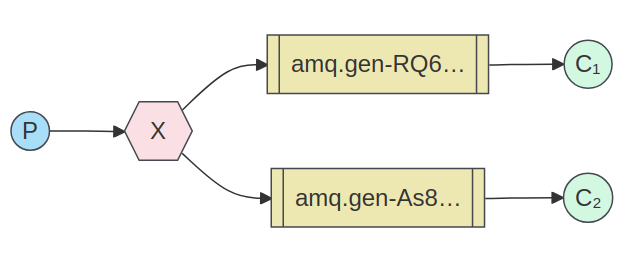
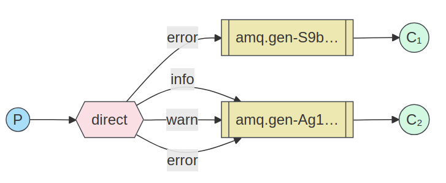
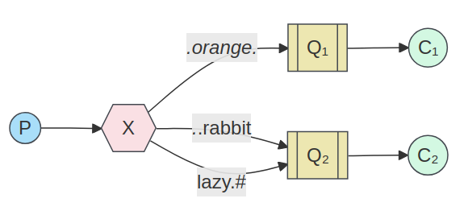

[](Pipfile)
[](https://github.com/octopusinvitro/bunny/blob/main/LICENSE.md)
[](https://codeclimate.com/github/octopusinvitro/bunny/maintainability)


# README

This project uses `pipenv` for dependency management and `unittest` as a testing framework.


## Setup

The `bin` folder has scripts for basic commands.

First, download the [community Docker image for RabbitMQ](https://hub.docker.com/_/rabbitmq/), then type:

```sh
docker run -it --rm --hostname localhost --name rabbitmq -p 5672:5672 -p 15672:15672 rabbitmq:latest
```

Create an environment in your preferred way and then:

```sh
pipenv install
```


## Run

### Durable work queues

Different messages will be sent to the same queue and will be read by different clients using **round-robin**.

You can run as many clients as you want. Each client consumes the same queue, called `hello`.

If you run the server first, you won't loose the message, because the queue is persisted independently of the connection by whoever runs first, server or client.

To start one client listening for messages on the `hello` queue:

```sh
. bin/client
```

To send messages, run:

```sh
. bin/server 'YOUR MESSAGE HERE'
```


### Broadcasting

The same messages will be sent to all queues and all broadcastees using **a fanout exchange**.

You can run as many broadcastees as you want. Each broadcastee consumes a different queue, which is automatically generated.

If you run the broadcaster first, you will loose the message, because the queue is created per connection by the broadcastee, so it dies with it.

To start one broadcastee listening for messages on a new queue:

```sh
. bin/broadcastee
```

To send messages, run:

```sh
. bin/broadcaster 'YOUR MESSAGE HERE'
```




### Routing

The same messages will be sent to all queues and routees that have a **specific routing_key**, using **a direct exchange**.

You can run as many routees as you want. Each routee consumes a different queue, which is automatically generated, and subscribes to specific routing keys.

The router has to specify not only the message, but the routing key that will receive it.

If you run the router first, you will loose the message, because the queue is created per connection by the routee, so it dies with it.

To start one routee listening for messages on a new queue and specific routing keys:

```sh
. bin/routee ROUTING_KEY_1 ROUTING_KEY_2 [...etc]
```

To send messages, run:

```sh
. bin/router ROUTING_KEY 'YOUR MESSAGE HERE'
```


> In this image, `info`, `warn` and `error` are routing keys.


### Filtering

Filtering is like Routing, but instead of a `direct` exchange we use a `topic` exchange

To see the effect, use a multiword routing key, for example for a two word multikey:

1. This receives all the logs, works like a `fanout` exchange (use quotes!):

```sh
. bin/filtered '#'
```

1. All logs from routing keys having `foo` as first word:

```sh
. bin/filtered foo.*
```

1. All logs from routing keys having `foo` as first word or `bar` as second word:

```sh
. bin/filtered foo.* *.bar
```

To send messages, run:

```sh
. bin/filterer foo.bar 'YOUR MESSAGE HERE'
```




## Checking status

```sh
. bin/status
```


## Testing

```sh
. bin/test                    # all tests
. bin/test tests/test_file.py # single test
```


## Linting

```sh
. bin/lint
```
