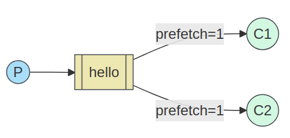

[](Pipfile)
[](https://github.com/octopusinvitro/bunny/blob/main/LICENSE.md)
[](https://codeclimate.com/github/octopusinvitro/bunny/maintainability)


# README

This project uses `pipenv` for dependency management and `unittest` as a testing framework.


## Setup

The `bin` folder has scripts for basic commands.

First, download the [community Docker image for RabbitMQ](https://hub.docker.com/_/rabbitmq/), then type:

```sh
docker run -it --rm --hostname localhost --name rabbitmq -p 5672:5672 -p 15672:15672 rabbitmq:latest
```

Create an environment in your preferred way and then:

```sh
pipenv install
```


## Run

### Durable work queues

Different messages will be sent to the same queue and will be read by different clients using **round-robin**.

You can run as many clients as you want. Each client consumes the same queue, called `hello`.

If you run the server first, you won't loose the message, because the queue is persisted independently of the connection by whoever runs first, server or client.

To start one client listening for messages on the `hello` queue:

```sh
. bin/client
```

To send messages, run:

```sh
. bin/server 'YOUR MESSAGE HERE'
```




### Broadcasting

The same messages will be sent to all queues and all broadcastees using **a fanout exchange**.

You can run as many broadcastees as you want. Each broadcastee consumes a different queue, which is automatically generated.

If you run the broadcaster first, you will loose the message, because the queue is created per connection by the broadcastee, so it dies with it.

To start one broadcastee listening for messages on a new queue:

```sh
. bin/broadcastee
```

To send messages, run:

```sh
. bin/broadcaster 'YOUR MESSAGE HERE'
```


## Checking status

```sh
. bin/status
```


## Testing

```sh
. bin/test                    # all tests
. bin/test tests/test_file.py # single test
```


## Linting

```sh
. bin/lint
```
